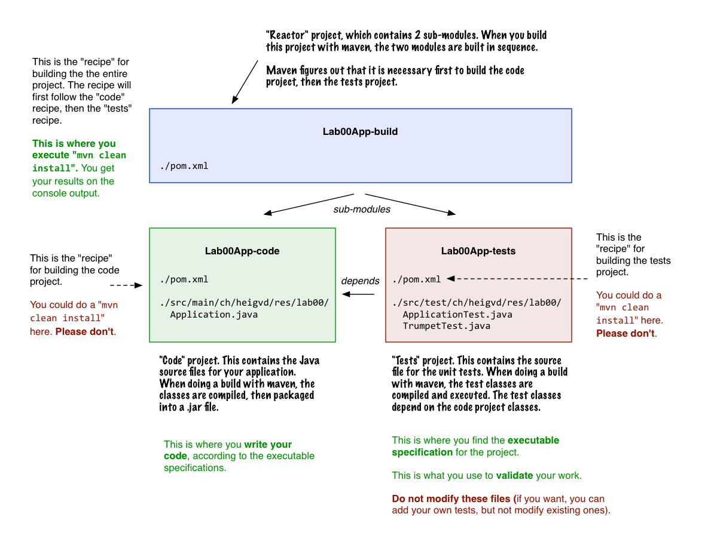

### Introduction

* **Task 1** :
* **Task 2** :
* **Task 3** :

-----

### Task 1 : Register on services and get your IDs

1. If you don't have a GitHub account yet, get one [here](https://github.com/).
2. If you have not registered on CyberLearn (moodle), register [here](http://cyberlearn.hes-so.ch/course/view.php?id=6971) (the password is *heigvdrocks*).
3. If you don't have a StackOverflow account yet, get one [here](https://www.stackoverflow.com).


### Task 2 : Setup the environment

In this lab, we will start by installing some of the tools that we will be using during the semester. Something that is very important (not only for this course) is to have a proper command line tool installed.

#### 1. Make sure that you have a JDK 1.8 installed

You should use Java 8. Depending on the platform, it can be a bit tricky to figure out which JDK is actually used when you run a Java application. When you build the same project in Netbeans or on the command line, it is possible that a different version of the JDK is actually used. Keep this in mind if you encounter issues (maven might complain).

For Mac OS users, [here](http://stackoverflow.com/questions/6588390/where-is-java-home-on-osx-yosemite-10-10-mavericks-10-9-mountain-lion-10) and [there](http://stackoverflow.com/questions/17824889/how-to-force-maven-3-1-to-use-right-version-of-java-on-mac-os-8-10), you will find useful information.

#### 2. Install apache maven

Apache maven is a software development tool that is extremely popular in the Java community. As a matter of fact, if you work in a professional environment or contribute to an open source project, there is *no way* that you will escape it.

While our goal is not to make you a maven expert in this course, we want you to get familiar with it. You will use maven to build, test and run your projects, so it is important that you have a high-level understanding of what it does.

If you have used Makefiles, ant scripts or Grunt.js, you are already familiar with the notion of **software build automation**. Simply stated, maven is used to write recipes for transforming source code into running software. It manages the entire build cycle, which includes tasks such as compilation, unit testing, integration testing, code quality checks, packaging and deployment.


In your home directory, there is a hidden directory named `.m2`. It contains a file named `settings.xml`, which is used to configure various aspects of your maven installation.

```
~/.m2/settings.xml
```

```
<settings>
...
  <profiles>
    <profile>
      <id>schoolPulse</id>
      <activation>
        <activeByDefault>true</activeByDefault>
      </activation>
      <properties>
        <ch.heigvd.schoolpulse.userid>wasadigi</ch.heigvd.schoolpulse.userid>
      </properties>
    </profile>
...
  </profiles>
...
</settings>
```

#### Install NetBeans

In this course, we will be writing a lot of code, mostly in Java. We use Netbeans to prepare that labs and samples. So, if you use Netbeans, your life will be easier. If you prefer to use another IDE, that should be fine for most of the labs (we will let you know otherwise). But we will not be able to provide individual support for all IDEs, so you have to be ready to investigate issues on your own.

#### Install and get familiar with a *real* command line tool


#### Check that you can do a tail

[Unix tail](http://en.wikipedia.org/wiki/Tail_%28Unix%29)

[PowerShell](https://technet.microsoft.com/en-us/library/hh849787.aspx)

[PowerShell -Tail](http://www.howtogeek.com/tips/how-to-get-tail-like-functionality-on-windows-with-powershell/)

#### Check that you can do a grep

[Unix grep](http://en.wikipedia.org/wiki/Grep)

[PowerShell](https://communary.wordpress.com/2014/11/10/grep-the-powershell-way/)


### Step 2 : Fork the GitHub repo

For the labs, we will be using a collaborative development workflow. You have to be familiar with git and the GitHub service. Here is a high-level description of the workflow:

1. We will create **one GitHub repo for every lab**. This repo will contain the instructions, a code skeleton. Often, we will provide a collection of JUnit tests that will allow us to **specify**, **validate** and **grade** your projects. If you try to run the JUnit tests at the beginning of the project, most of them should fail (they might not even compile). Reading the code of the tests will let you know what we expect from you (the tests are an **executable specification**).

2. You will **fork** the lab repo. Read this sentence again very carefully: we said **fork** and **not clone**. Forking the lab repo means that you will have your own copy of the lab repo hosted on GitHub, so that you can work independently. When you have your work, then you will clone it on your machine. Once again, you will **not** clone our original repo but **your fork**.

3. You will then work on the assignment, write code do you tests. You should get used to commit your work on a regular basis (which means that you will have a local history). Before the submission date, you will then **push** your commits to your fork. You should also create a **pull request**, so that we know that you are done (and it's a way for us to provide feedback on the code).

4. *We know where you live*. After submission, we have access to your repos. We have our own suite of automated tests, which we will use to check your work.


### Step : Understand the project structure



### Step 4 : Run the JUnit automated tests

```
mvn clean test
```

### Step 5 : Fix the broken JUnit tests

```
mvn clean test
```


### Step 6 : Submit your results


