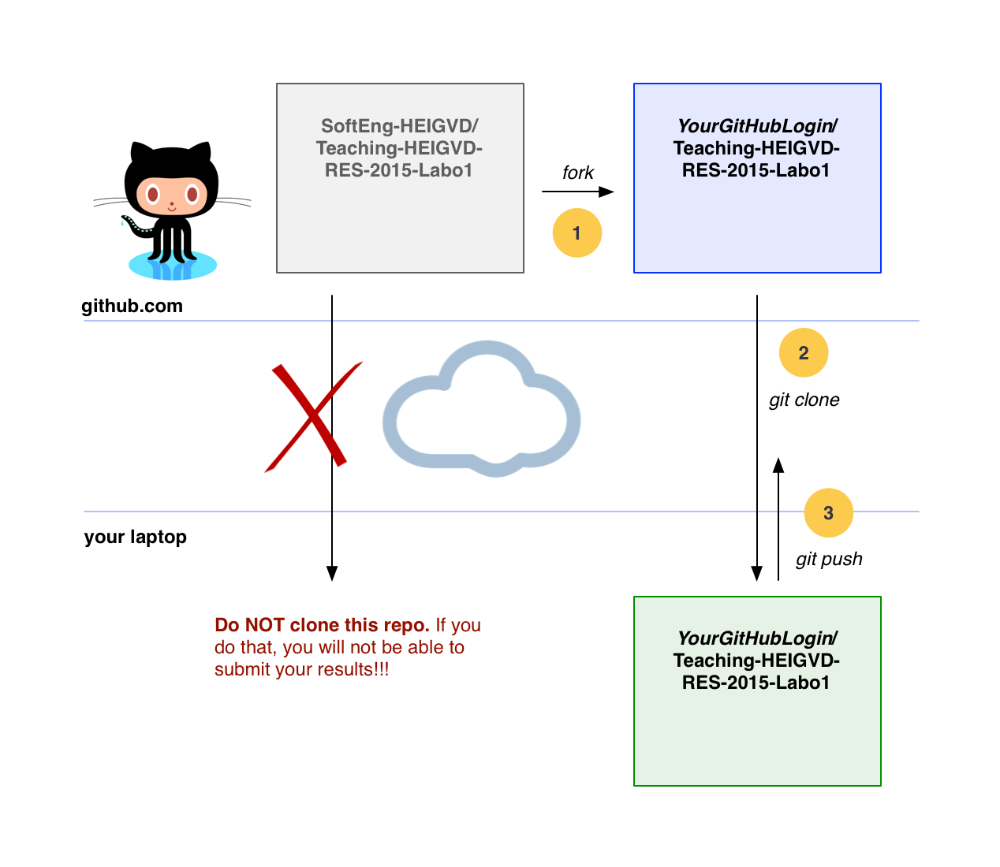

### Introduction

* **Task 1** : Register on services and get your IDs (10')
* **Task 2** : Setup the environment (30')
* **Task 3** : Fork this GitHub repo (10')
* **Task 4** : Understand the project structure (10')
* **Task 5** : Develop the Java code according to the executable specification (60')
* **Task 6** : Submit your results (15')

-----

### Task 1 : Register on services and get your IDs

1. If you don't have a **GitHub** account yet, get one [here](https://github.com/).
2. If you have not registered on **CyberLearn (moodle)**, register [here](http://cyberlearn.hes-so.ch/course/view.php?id=6971) (the password is *heigvdrocks*).
3. If you don't have a **StackOverflow** account yet, get one [here](https://www.stackoverflow.com).


-----

### Task 2 : Setup the environment

In this lab, we will start by installing some of the tools that we will be using during the semester. 

#### 2.1. Make sure that you have a JDK 1.8 installed

You should use Java 8. Depending on the platform, it can be a bit tricky to figure out which JDK is actually used when you run a Java application. When you build the same project in Netbeans or on the command line, it is possible that a different version of the JDK is actually used. Keep this in mind if you encounter issues (maven might complain).

For Mac OS users, [here](http://stackoverflow.com/questions/6588390/where-is-java-home-on-osx-yosemite-10-10-mavericks-10-9-mountain-lion-10) and [there](http://stackoverflow.com/questions/17824889/how-to-force-maven-3-1-to-use-right-version-of-java-on-mac-os-8-10), you will find useful information.

To **validate** your installation, you can do a `java -version` from the command line.


#### 2.2. Install apache maven


Apache maven is a software development tool that is extremely popular in the Java community. As a matter of fact, if you work in a professional environment or contribute to an open source project, there is *no way* that you will escape it.

While our goal is not to make you a maven expert in this course, we want you to get familiar with it. You will use maven to build, test and run your projects, so it is important that you have a high-level understanding of what it does.

If you have used Makefiles, ant scripts or Grunt.js, you are already familiar with the notion of **software build automation**. Simply stated, maven is used to write recipes for transforming source code into running software. It manages the entire build cycle, which includes tasks such as compilation, unit testing, integration testing, code quality checks, packaging and deployment.

We will not get into further details right now. Installing maven on your machine is easy. Just go [here](http://maven.apache.org/download.cgi#Installation) and follow the instructions. When you are done, make sure to update your system path so that you can invoke maven with the `mvn` command from a terminal, wherever your are. If you are using Windows, [this](http://crunchify.com/how-to-setupinstall-maven-classpath-variable-on-windows-7/) page might be helpful.

When you have installed maven, you should be able to type `mvn -v` on the command line and see the following output:

```
$ mvn -v
Apache Maven 3.1.0 (893ca28a1da9d5f51ac03827af98bb730128f9f2; 2013-06-28 04:15:32+0200)
Maven home: /Users/admin/tools/maven/apache-maven-3.1.0
Java version: 1.8.0_11, vendor: Oracle Corporation
Java home: /Library/Java/JavaVirtualMachines/jdk1.8.0_11.jdk/Contents/Home/jre
Default locale: en_US, platform encoding: UTF-8
OS name: "mac os x", version: "10.9.5", arch: "x86_64", family: "mac"
```


In your home directory, there is a hidden directory named `.m2`. It contains a file named `settings.xml`, which is used to configure various aspects of your maven installation. You have to edit this file and **add your GitHub login name** in a new `<profile></profile>` section. Have a look at the example below. Grab the text, replace `wasadigi` with **your GitHub login** and save the file.

```
~/.m2/settings.xml
```

```
<settings>
...
  <profiles>
    <profile>
      <id>schoolPulse</id>
      <activation>
        <activeByDefault>true</activeByDefault>
      </activation>
      <properties>
        <ch.heigvd.schoolpulse.userid>wasadigi</ch.heigvd.schoolpulse.userid>
      </properties>
    </profile>
...
  </profiles>
...
</settings>
```

#### 2.3. Install NetBeans


In this course, we will be writing a lot of code, mostly in Java. We use Netbeans to prepare that labs and samples. So, if you use Netbeans, your life will be easier. If you prefer to use another IDE, that should be fine for most of the labs (we will let you know otherwise). But we will not be able to provide individual support for all IDEs, so you have to be ready to investigate issues on your own.

#### 2.4. Install and get familiar with a *real* command line tool


From what we have seen over the last few years, many students are not familiar or **comfortable with a terminal and command line tools**. This is particularly true for students using Windows as their main operating system. Launching `cmd.exe` is not something very usual, and once in the terminal, it is not very easy nor practical to get work done.

**If you are in this situation, then it is now time to get familiar with proper tools**. This will make you a lot more productive. It will save you time during labs (not only in this course). It will allow you to do things in a cleaner and more efficient way. 

**You do not have to be a shell guru**. Even with a couple of commands, you will quickly see the benefits. **Please, please** take the time to learn how to use this crucial tool.

If you are on **Windows**, then you have several options, including PowerShell, Gygwin, Git Bash or Babun, which seems to be gaining traction. Some of the options are described [here](https://macyves.wordpress.com/2014/09/18/hipsterising-windows-cygwin-vs-babun-vs-git-bash-vs-powershell-the-onion-scale/). To be honest, I am *not* a Windows user, so it is difficult for me to make a recommendation and you will have to make your own experiments. But if you have not used any of these tools, take the time to pick one and learn how to use it. Otherwise, you will loose an awful lot of time and will not be able to do some of the labs (this year and next year). 

#### Check that you can do a tail

[Unix tail](http://en.wikipedia.org/wiki/Tail_%28Unix%29)

[PowerShell](https://technet.microsoft.com/en-us/library/hh849787.aspx)

[PowerShell -Tail](http://www.howtogeek.com/tips/how-to-get-tail-like-functionality-on-windows-with-powershell/)

#### Check that you can do a grep

[Unix grep](http://en.wikipedia.org/wiki/Grep)

[PowerShell](https://communary.wordpress.com/2014/11/10/grep-the-powershell-way/)

-----

### Step 3 : Fork the GitHub repo

Ok, now that your environment is setup, **time to get to the real work**. For the labs, we will be using a **collaborative development workflow**. You have to be familiar with git and the GitHub service. Here is a high-level description of the workflow:



1. We will create **one GitHub repo for every lab**. This repo will contain the instructions, a code skeleton. Often, we will provide a collection of JUnit tests that will allow us to **specify**, **validate** and **grade** your projects. If you try to run the JUnit tests at the beginning of the project, most of them should fail (they might not even compile). Reading the code of the tests will let you know what we expect from you (the tests are an **executable specification**).

2. You will **fork** the lab repo. Read this sentence again very carefully: we said **fork** and **not clone**. Forking the lab repo means that you will have your own copy of the lab repo hosted on GitHub, so that you can work independently. You will then **clone your fork** on your machine. Once again, what you are cloning is your fork, not the original repo. Got it?

3. You will then work on the assignment, write code do you tests. You should get used to commit your work on a regular basis (which means that you will have a local history). Before the submission date, you will then **push** your commits to your fork. You should also create a **pull request**, so that we know that you are done (and it's a way for us to provide feedback on the code).

4. *We know where you live*. After submission, we will check your forks. We have our own suite of automated tests, which we will use to evaluate your work.


-----

### Task : Understand the project structure


-----


```
mvn clean test
```

### Task 5 : Develop the Java code according to the executable specification

#### 5.1 : Run the JUnit automated tests
#### 5.2 : Fix the broken JUnit tests
#### 5.3 : Activate the TrumpetTest.java tests
#### 5.4 : Develop the Java code iteratively

```
mvn clean test
```

### Task 6 : Submit your results


